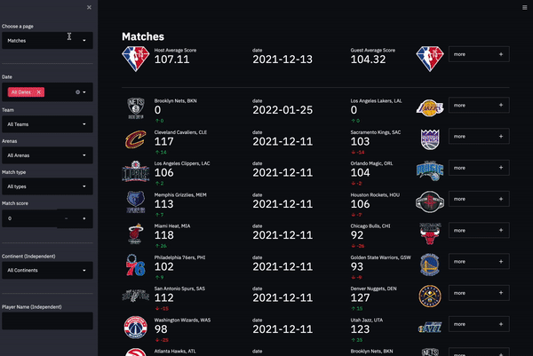
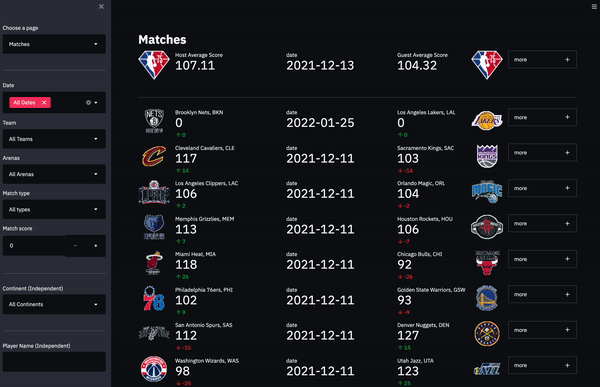
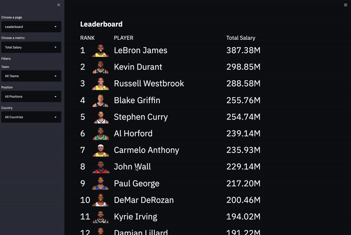
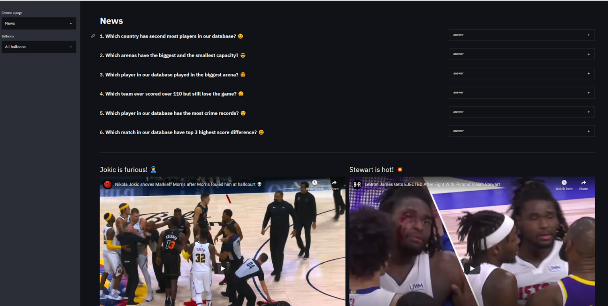

# NBA-Stats


## Usage
1. Upload code and data to the jedi server
```
scp -r project mh6069@jedi.poly.edu:~/
```
2. Connect to jedi
```
ssh mh6069@jedi.poly.edu -L 8700:localhost:8700
```
3. Load schema.sql
```
cd project
psql -h localhost -U mh6069 mh6069_db
\i schema.sql
```

4. Port forwarding and run the Streamlit app
```
cd project
streamlit run project.py --server.address=localhost --server.port=8700
```
## Demo

### Overview



### Matches



### Players


### Leaderboard



### News


