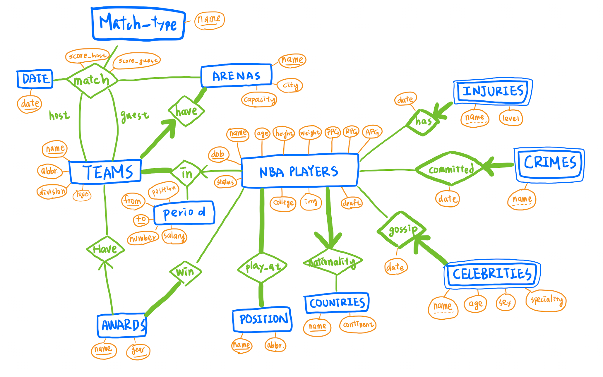
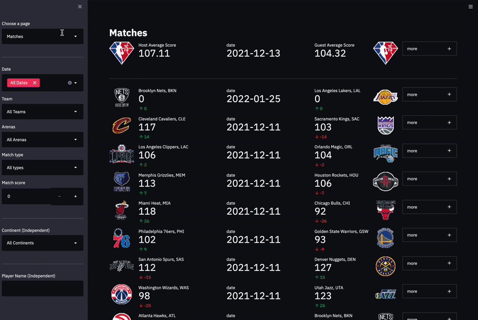
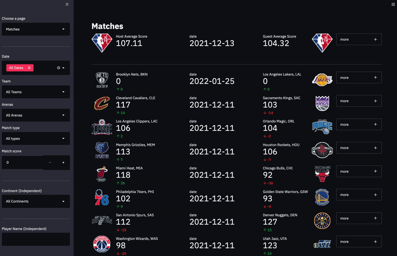
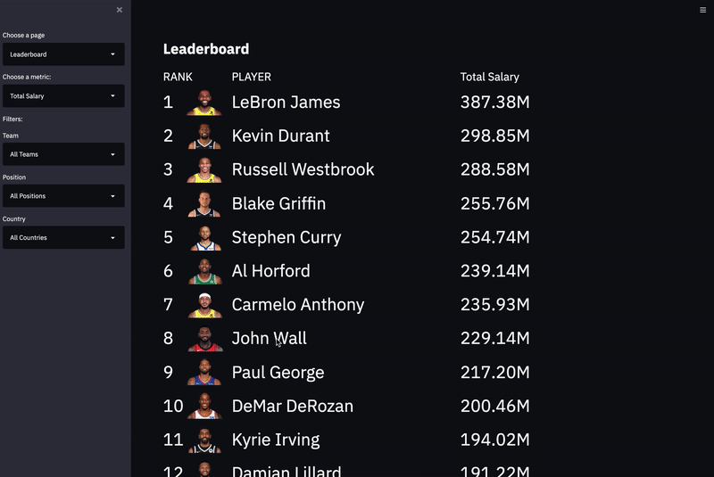

# NBA-Stats


## Description

This project will collect and integrate NBA players’ personal information, corresponding matches, stats, and all their gossip, news and crime record into a well visualized website/app. Users can search and find the whole information about their favorite NBA players, or the players they are interested in, on this website/app. Also, it will show the recent NBA matches, lead players in different fields and some fun facts.

## Usage
1. Upload code and data to the jedi server
```
scp -r project mh6069@jedi.poly.edu:~/
```
2. Connect to jedi
```
ssh mh6069@jedi.poly.edu -L 8700:localhost:8700
```
3. Load schema.sql
```
cd project
psql -h localhost -U mh6069 mh6069_db
\i schema.sql
```

4. Port forwarding and run the Streamlit app
```
cd project
streamlit run project.py --server.address=localhost --server.port=8700
```
## ER Diagram



## Demo

### Overview



### Matches



### Players


### Leaderboard



### News


